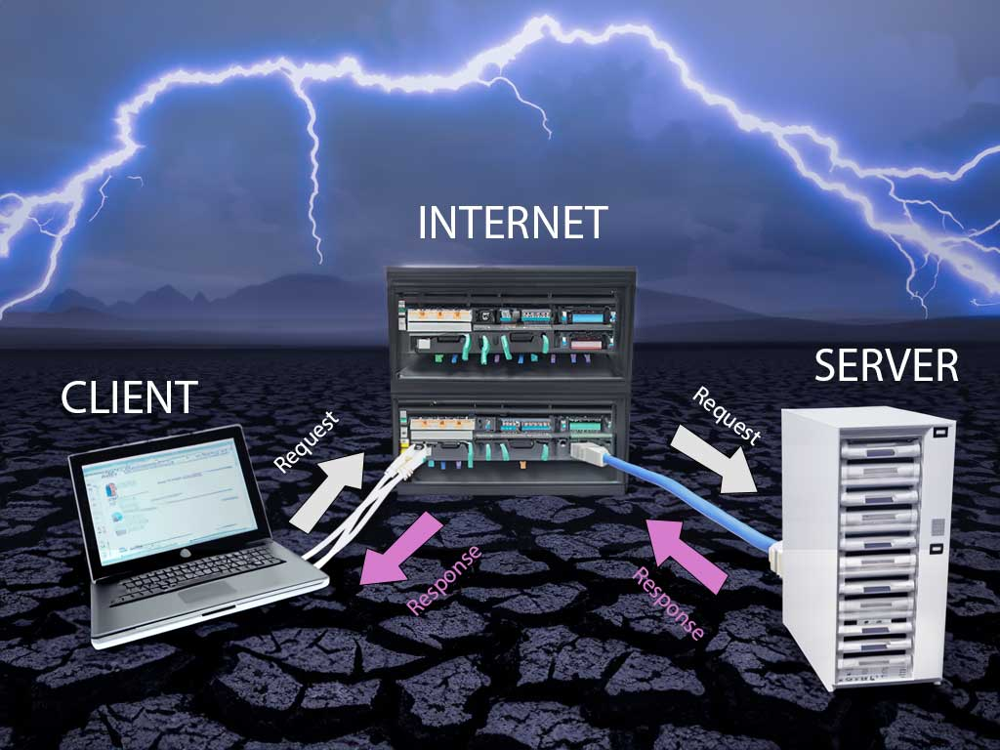

# How web application works

---

## Client-Server Architecture

- The client, which can be a user's device (e.g., computer or smartphone) with a web browser, connects to the server over the internet.
- The server, a computer that hosts the web application, stores its data and responds to client requests.
- The internet acts as the communication medium, allowing the client and server to exchange data and establish connections.
- The Hypertext Transfer Protocol (HTTP) is commonly used for communication between the client and server.
- Clients send HTTP requests to the server, specifying the URL (Uniform Resource Locator) of the web application.
- The server processes the HTTP request, performs the necessary operations, and generates an HTTP response.
- The HTTP response contains the requested data, which can include HTML, CSS, JavaScript, or other formats.
- The client's web browser receives the HTTP response and renders the content, displaying the web application's user interface.
- Users interact with the web application by triggering new HTTP requests, which the server processes to provide the desired functionality.

## Data Storage and Retrieval

- Web applications store and retrieve data using databases like MySQL, PostgreSQL, or MongoDB.
- Back-end code interacts with the database to perform operations like storing, updating, and retrieving information.

## Server-Side Processing

- The server-side code processes the data sent by the client and generates a response.
- The response can be in the form of HTML, CSS, JavaScript, or data in other formats like JSON or XML.

## Dynamic Content

- Web applications provide dynamic content that can change based on user input or data from databases.
- For example, personalized recommendations on an e-commerce website are generated dynamically.

## Client-Side Rendering

- Once the client receives the server's response, the web browser renders the HTML, CSS, and JavaScript.
- JavaScript code in the response adds interactivity and enables dynamic behavior on the client-side.

## Continuous Interaction

- Users interact with the web application by performing actions like clicking buttons or submitting forms.
- These interactions trigger new requests from the client to the server, creating a continuous cycle of interaction.

---

## Front-End Development

- Front-end development involves creating the user interface using HTML, CSS, and JavaScript.
- Front-end developers implement the design and interactivity of the web application.

## Back-End Development

- Back-end development handles server-side logic and data processing.
- Back-end developers use programming languages like Python, Ruby, PHP, or Node.js to handle the requests and responses.

--- 

## Overall

- Web applications combine front-end and back-end technologies to deliver a user-friendly interface.
- They process user input, enabling interaction with the application's functionalities.
- Web applications retrieve and store data, facilitating efficient information management.
- They provide dynamic functionality, offering real-time updates and personalized experiences.
- Users access web applications through their web browsers, making them easily accessible.
- Web applications offer a wide range of services and features tailored to specific needs.
- They provide online access to various resources, such as educational materials, tools, and services.
- Web applications facilitate collaboration and communication among users.
- They may include features like discussion boards, messaging systems, and shared document repositories.
- Web applications enhance convenience by enabling access from anywhere with an internet connection.

---

[What is a tech stack?](https://www.youtube.com/watch?v=Sxxw3qtb3_g)

