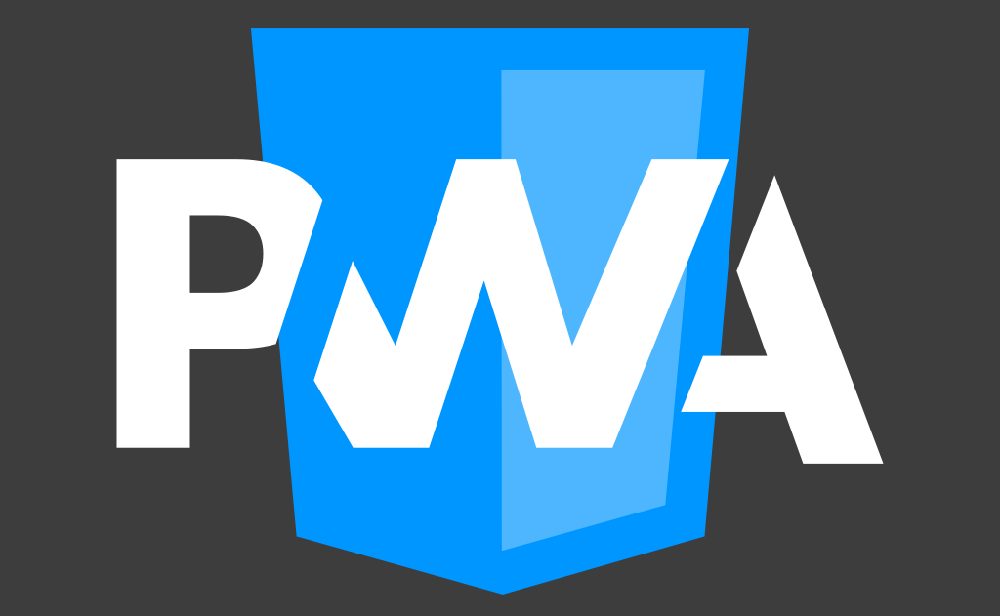

# [PWA](https://developer.mozilla.org/en-US/docs/Web/Progressive_web_apps)
#### A Progressive Web App is a web-app that the user can (and wants) to add to mobile device's home screen


## What are Progressive Web Applications?
* Combination of technologies to make web apps of more quality and to make better UX for mobile devices.
* Goal is to make web apps more like native apps.
* PWA app of so good quality that it deserves its place with native apps in the user's home screen.

## Key properties
1. Service Workers
2. Add to home screen
3. Responsive layout
4. Browser independence
5. HTTPS
6. Fast first load

#### What PWA tries to fix
1. Typing URL sucks
2. Web apps are dependent of network connection's quality
3. UX not as good as with native apps
4. Browser's UI occupies space

### Minimum Criteria
1. Use HTTPS
2. Register a Service Worker with a fetch event handler
3. Valid web manifest file with a minimal home screen icon set

## Components

### [Service Worker](https://developer.mozilla.org/en-US/docs/Web/API/Service_Worker_API)
* A script that is executed separate from the application.
* Provides abilities previously offered only by native apps.
  * caching
  * persistent data syncing in the background [(not iOS, maybe, sort of)](https://medium.com/@firt/iphone-11-ipados-and-ios-13-for-pwas-and-web-development-5d5d9071cc49)
  * push notifications (not iOS)
  * sensors, camera etc. (os dependent)
  
  Service Worker installation
  ```javascript
  (async() => {
      if ('serviceWorker' in navigator) {
          try {
            const worker = await navigator.serviceWorker.register('./sw.js');
            console.log('Service Worker Registered');
          } catch (e) {
            console.log(e.message);
          }
      }
  })();
  ```
  
  After installation load static resources (e.g. app shell) to cache (sw.js):
  ```javascript
  self.addEventListener('install', (event) => {
    event.waitUntil((async () => {
          try {
            const cache = await caches.open('v1');
            return cache.addAll(arrayOfYourStaticFiles);
          } catch (e) {
            console.log(e.message);
          }
      })());
  });
  ```
  After caching return files from the cache
  ```javascript
  self.addEventListener('fetch', (event) => {
    console.log('ServiceWorker Fetch', event.request.url);
    event.respondWith((async () => {
          try {
              const response = await caches.match(event.request);
              return response || fetch(event.request);
          } catch (e) {
              console.log(e.message);
          }
      })());
  });
  ``` 
 
### The Web App manifest
* Enables add to home screen
* Contains info about icons and start up behavior

manifest.json
```json
{
  "name": "App",
  "short_name": "App",
  "icons": [{
      "src": "images/icons/icon-152x152.png",
      "sizes": "152x152",
      "type": "image/png"
    }, {
      "src": "images/icons/icon-192x192.png",
      "sizes": "192x192",
      "type": "image/png"
    }, {
      "src": "images/icons/icon-256x256.png",
      "sizes": "256x256",
      "type": "image/png"
    }],
  "start_url": "/index.html",
  "display": "standalone",
  "background_color": "#2ACCFF",
  "theme_color": "#FF2ACC"
}
```

### Tools & Links
1. [Debug Progressive Web Apps](https://developer.chrome.com/docs/devtools/progressive-web-apps)
2. [PWA Builder](https://www.pwabuilder.com/)
3. [web.dev](https://web.dev/progressive-web-apps/)
4. [PWA asset generator](https://www.npmjs.com/package/pwa-asset-generator)
5. [Workbox](https://developer.chrome.com/docs/workbox/)
6. [Manifest generator](https://progressier.com/pwa-manifest-generator)

## Assignment
1. [Follow this article to create a basic Hello World PWA](https://medium.com/james-johnson/a-simple-progressive-web-app-tutorial-f9708e5f2605)
   * [Upload the files to users.metropolia.fi](https://www.youtube.com/watch?v=CDXEu4piXRA&list=PLKenVLUxjmH-y89AiiI2xcXDy5QG83D4K&index=7&ab_channel=IlkkaKylm%C3%A4niemi-Metropolia) since https is required, Azure is not needed
     * Make sure all paths and links are relative!
     * [3 ways to redirect to HTTPS](https://www.eukhost.com/kb/3-simple-ways-to-redirect-a-website-from-http-to-https/)
   * Use arrow functions and async/await with try/catch instead of then/catch
   * Test on your phone that you can add the app to home screen
   * Skip Lighthouse, since it's not used anymore. [Instead use 'Application' tab in Developer Tools](https://developer.chrome.com/docs/devtools/progressive-web-apps). 
2. Add more content to the app
   * Add a few paragraphs of text
   * Add an image to the app background
   * Add a font
      * [Google Fonts](https://fonts.google.com/)
      * Download the font(s) to your own computer/server
   * Images and fonts should be available also when your device is offline.
   * Submit a link to your app in users.metropolia.fi
   
   
## Background Sync
* [Background Sync with Service Workers](https://davidwalsh.name/background-sync)
* [IndexedDB](https://developer.mozilla.org/en-US/docs/Web/API/IndexedDB_API/Using_IndexedDB)
